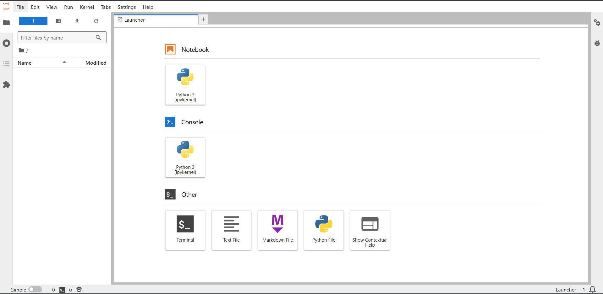

# JupyterHub tutorial

### Login
Go to the link `http://192.168.172.72:8000/` and sign in  with your username and password.


### Creating a Notebook
Once you are logged in, you will see a page like this:



This is called **Launcher**
The left pane is the File Browser, it is the area where you will see all you files and folders present in your account. You can make use of ***New Folder***, ***Upload Files*** buttons situated right below ***Run Menu***.

Click on python icon under the Notebook section to create a new notebook. This will create a new notebook in the ***current directory***. If you want to create a new notebook in specific directory, navigate to that folder and then click on python icon under notbook section.

### Running programs

Once you have created a notebook, you can run your python programs. You can run a cell by clicking on the play button on the top menu of the notebook as shown below.


You can access launcher again by clicking on **"+"**.

### Running Spark Jobs

The notebook has the ability to automatically send all the jobs to the spark master. Run the below snippet of code in a cell to create a spark session on the spark master with connection to the Minio Bucket.

```
from pyspark import SparkConf
from pyspark.sql import SparkSession


# Removing hard coded password - using os module to import them
import os
import sys

conf = SparkConf()
conf.set('spark.jars.packages', 'org.apache.hadoop:hadoop-aws:3.2.0')
conf.set('spark.hadoop.fs.s3a.aws.credentials.provider', 'org.apache.hadoop.fs.s3a.SimpleAWSCredentialsProvider')

conf.set('spark.hadoop.fs.s3a.access.key', 'nsajja')
conf.set('spark.hadoop.fs.s3a.secret.key', 'b2272494-eb0a-11ee-830c-773f3f177200')
# Configure these settings
# https://medium.com/@dineshvarma.guduru/reading-and-writing-data-from-to-minio-using-spark-8371aefa96d2
conf.set("spark.hadoop.fs.s3a.path.style.access", "true")
conf.set("spark.hadoop.fs.s3a.impl", "org.apache.hadoop.fs.s3a.S3AFileSystem")
# https://github.com/minio/training/blob/main/spark/taxi-data-writes.py
# https://spot.io/blog/improve-apache-spark-performance-with-the-s3-magic-committer/
conf.set('spark.hadoop.fs.s3a.committer.magic.enabled','true')
conf.set('spark.hadoop.fs.s3a.committer.name','magic')
# Internal IP for S3 cluster proxy
conf.set("spark.hadoop.fs.s3a.endpoint", "http://system54.rice.iit.edu")
# Send jobs to the Spark Cluster
conf.setMaster("spark://sm.service.consul:7077")

spark = SparkSession.builder.appName("Your App Name")\
    .config('spark.driver.host','ubuntu-infra-vm0.service.consul').config(conf=conf).getOrCreate()
```
The above code will create a new spark session with the configurations required to connect to S3 bucket. You can add your own configurations as need with `conf.set()`.

Now, you can make use of the `SparkSession` object created in this case `spark`, in the forthcoming cells to run the spark jobs.

Once you create a session spark master will ***treat it as a job and assigns resources***. You need to stop the session as shown below to create a new session or once your job is completed.

```
spark.stop()
```
<code style="color : red">***Note: you must stop your session before closing the notebook with `spark.stop()`. This helps to free up resources assigned to your job, such that other jobs in the queue can make use of them.*** </code>

### Terminal

In the launcher click on ***Terminal*** in the ***other*** section.


This is like any other linux terminal, you can do everything that your normal profile terminal allows you to do.

The main use of this section in this case is to ***clone and manage GitHub Repo's***. Clone your repository via ssh using `git clone`.

For more information on cloning your repo [click here](https://github.com/illinoistech-itm/jhajek/tree/master/itmd-521/git-tutorial).